# A Hybrid ConvNeXt–Swin Transformer for Robust, Fair, and Calibrated Skin Disease Classification


## Overview


This repository contains my MSc Artificial Intelligence dissertation project completed at Brunel University London.


The project investigates whether combining convolutional neural networks (CNNs) and vision transformers can improve the accuracy, robustness and fairness of automated skin disease classification compared with a conventional ResNet-50 baseline.


Alongside model development, this project evaluates responsible AI considerations including fairness across different skin tones, confidence calibration, explainability using Grad-CAM, and class-wise performance analysis to move beyond traditional accuracy-focused evaluation.


## Web Application

The project includes a prototype web application that allows users to upload a skin image and receive a predicted classification with confidence scores and risk-level guidance.

### Low Risk Example

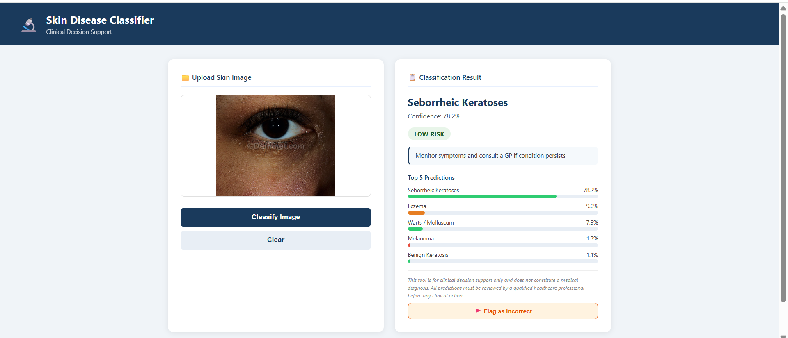

### Medium Risk Example

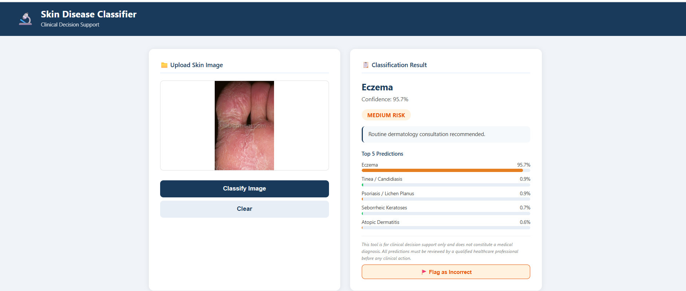

### High Risk Example

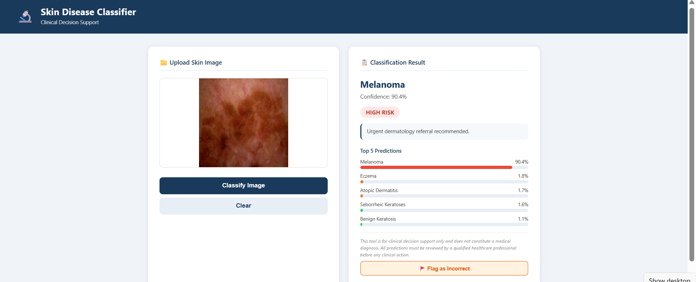


## Quick Start

```bash
git clone https://github.com/Naomikn/skin-disease-classification

cd skin-disease-classification

pip install -r web_app/requirements.txt

python web_app/main.py
```

## Research Objectives


The objectives of this project were to:


\- Develop a hybrid deep learning architecture combining ConvNeXt-Small and Swin Transformer-Small.

\- Compare performance against a ResNet-50 baseline trained under identical experimental conditions.

\- Evaluate classification performance using multiple metrics rather than accuracy alone.

\- Investigate fairness across different skin tones.

\- Assess model confidence calibration.

\- Demonstrate deployment through a prototype web application.


## Dataset


The models were trained using a publicly available dermatology image dataset containing more than 27,000 dermoscopic images spanning ten skin disease classes. The dissertation uses this dataset to compare baseline and hybrid deep learning models under consistent experimental conditions.


**Dataset:** [Skin Diseases Image Dataset (Kaggle)](https://www.kaggle.com/datasets/ismailpromus/skin-diseases-image-dataset)

> **Note:** The dataset is not included in this repository due to licensing restrictions and its size (approximately 5.6 GB). Users should download it directly from Kaggle before reproducing the experiments.


\*The dataset is not included in this repository due to licensing and file size considerations.\*


## Model Architecture


The proposed model combines:


\- ConvNeXt-Small

\- Swin Transformer-Small

\- Attentional Feature Fusion (AFF)

## Hybrid Model Architecture

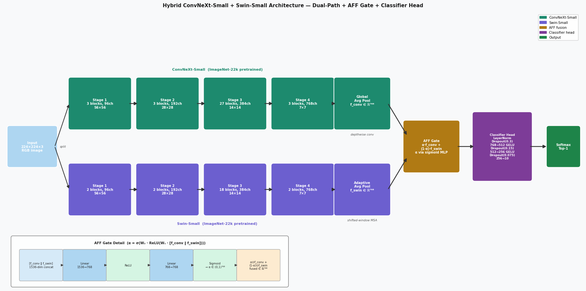

## Baseline Model Architecture

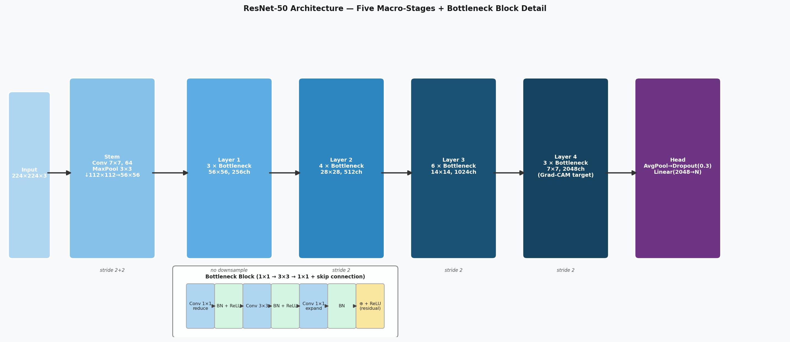

The hybrid architecture captures both local convolutional features and global attention-based representations before performing multi-class skin disease classification.


## Results


Compared with the ResNet-50 baseline, the proposed hybrid model achieved:


- **90.27% classification accuracy**

- **Macro F1-score: 0.866**

- **11.79 percentage point improvement** over the baseline

- Reduction in skin tone performance disparity from approximately **8.0 percentage points** to **2.68 percentage points**


The project also evaluated:


\- Fairness

\- Confidence calibration

\- Grad-CAM explainability

\- Class-wise performance

\- Comparative benchmarking against published literature


## Visual Results

### Training Curves

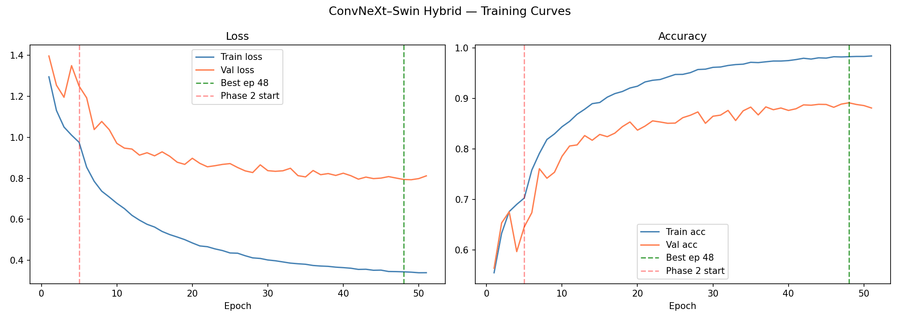

### Confusion Matrix

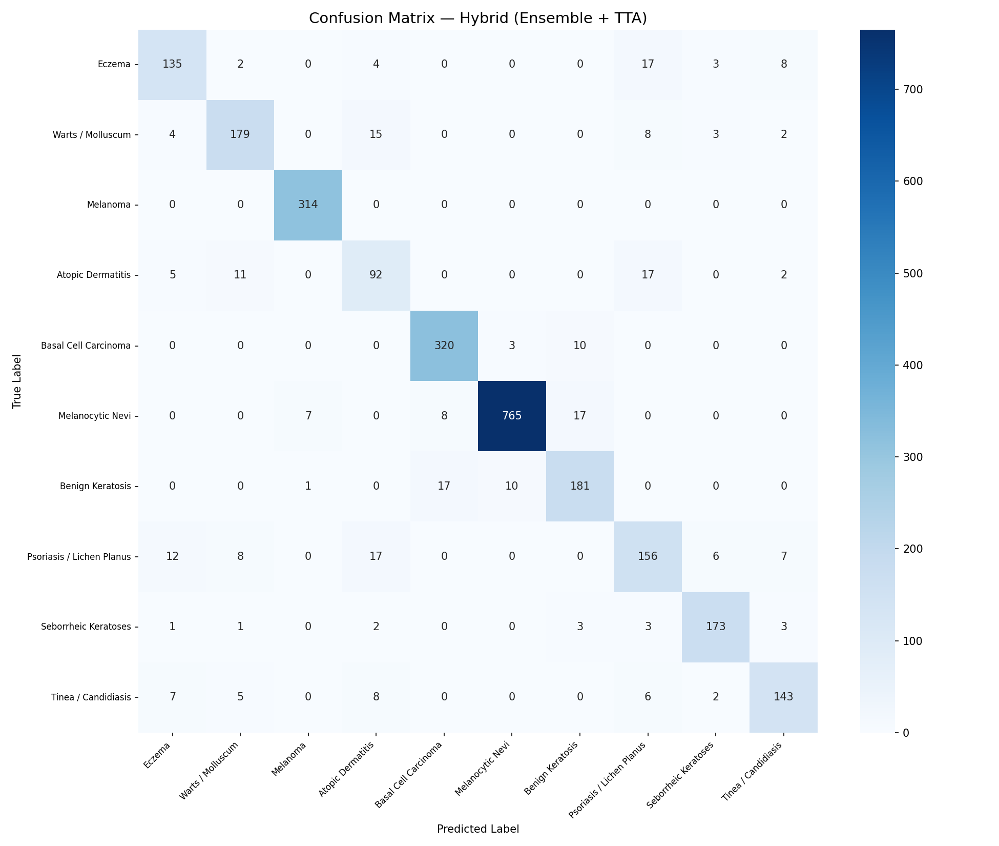

### Confidence Calibration

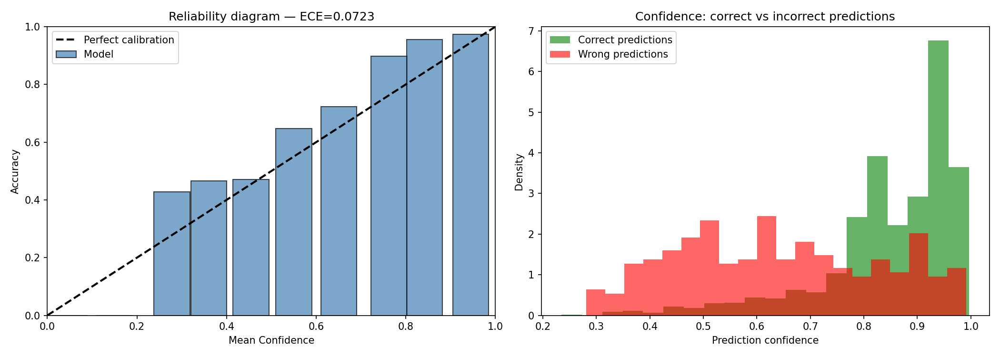

### Skin Tone Fairness Analysis

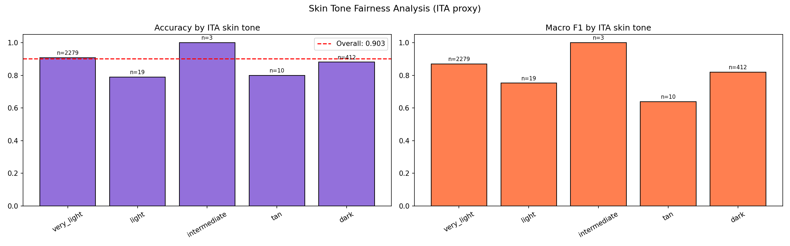

### Precision and Recall Comparison

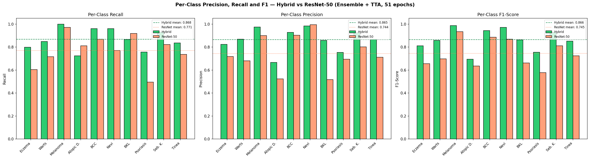

### Per-Class Metrics

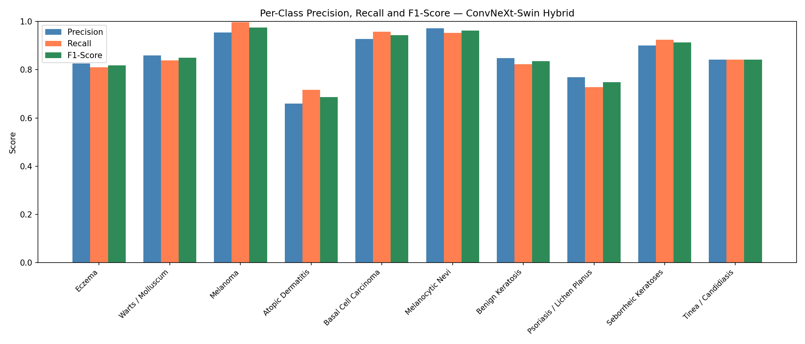


## Repository Structure


```

skin-disease-classification/

│

├── notebooks/              # Model development notebooks

├── results/                # Training curves and evaluation outputs

│   ├── hybrid/

│   └── resnet/

├── demo\_images/            # Sample prediction images

├── web\_app/                # Prototype deployment

├── web\_app\_screenshots/    # Screenshots of the application

├── dissertation.pdf        # Full dissertation

└── README.md

```


## Technologies Used


\- Python

\- PyTorch

\- NumPy

\- Pandas

\- Matplotlib

\- OpenCV

\- Scikit-learn

\- FastAPI

\- Jupyter Notebook


## Repository Contents


This repository includes:


\- Full MSc dissertation

\- Model training notebooks

\- Experimental results

\- Performance evaluation

\- Prototype web application

\- Demonstration images


## Future Work


Potential future improvements include:


\- Larger and more diverse dermatology datasets

\- Clinical validation

\- Lightweight deployment for mobile devices

\- Additional explainability techniques

\- External validation across healthcare settings


## Disclaimer


This project was developed for academic research purposes and is \*\*not intended for clinical diagnosis or medical decision-making\*\*.


